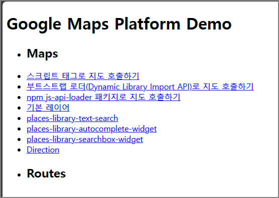

# Google Maps Platform Demo
--- 
Google Maps Platform Demo created with html, css, js

### API_KEY 변경

.env 파일의 VITE_API_KEY=\*\*\*ADD_YOUR_API\*\*\* 부분을 자신의 Google Maps API Key 로 변경합니다.

### node_module 설치

node_module 의존성 설치

`npm i`

서버 실행

`npm run dev`

다음과 같이 표시되면 해당 링크로 테스트 페이지 접근

VITE v4.4.7  ready in 384 ms

  ➜  Local:   http://localhost:5173/
  ➜  Network: use --host to expose
  ➜  press h to show help

### 인덱스 페이지

